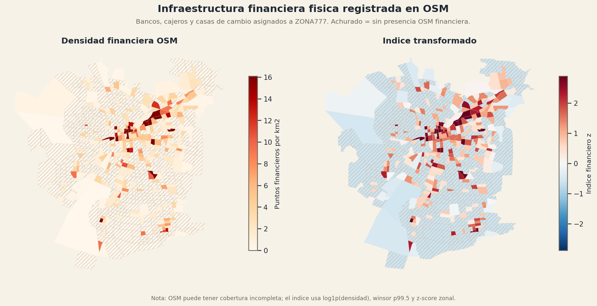
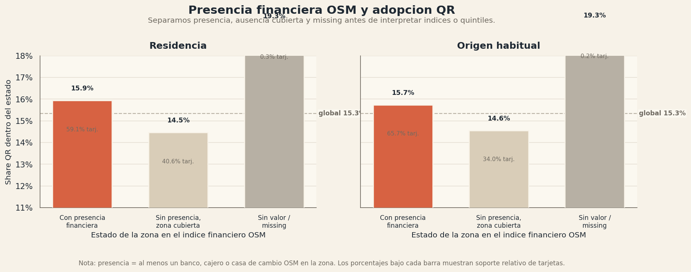
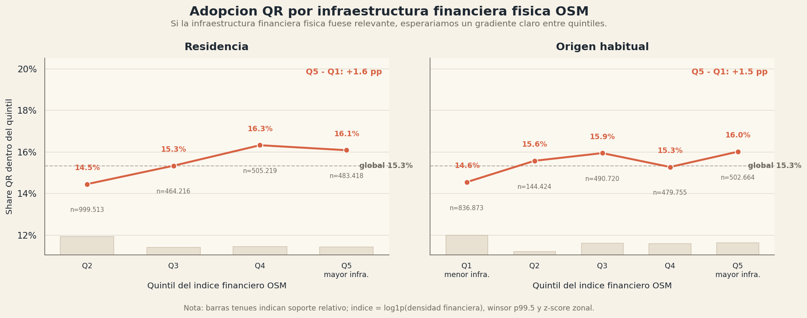
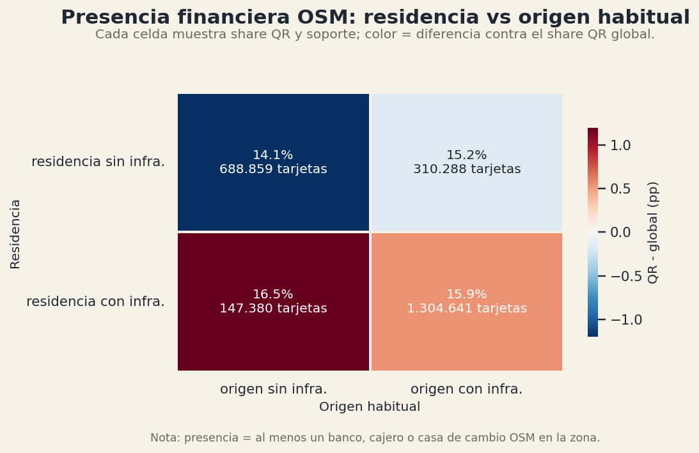
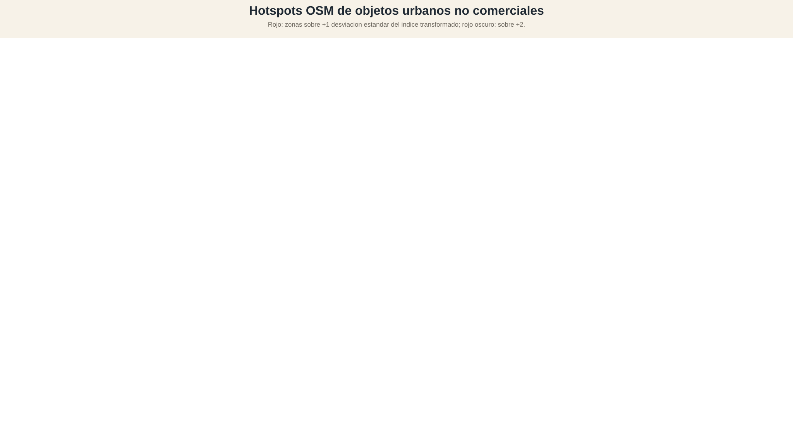
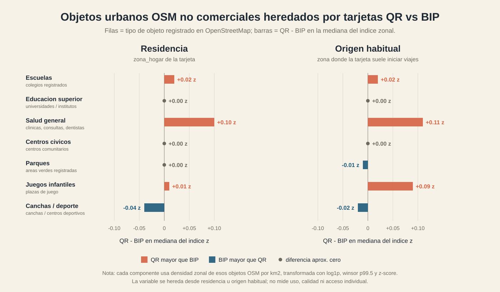
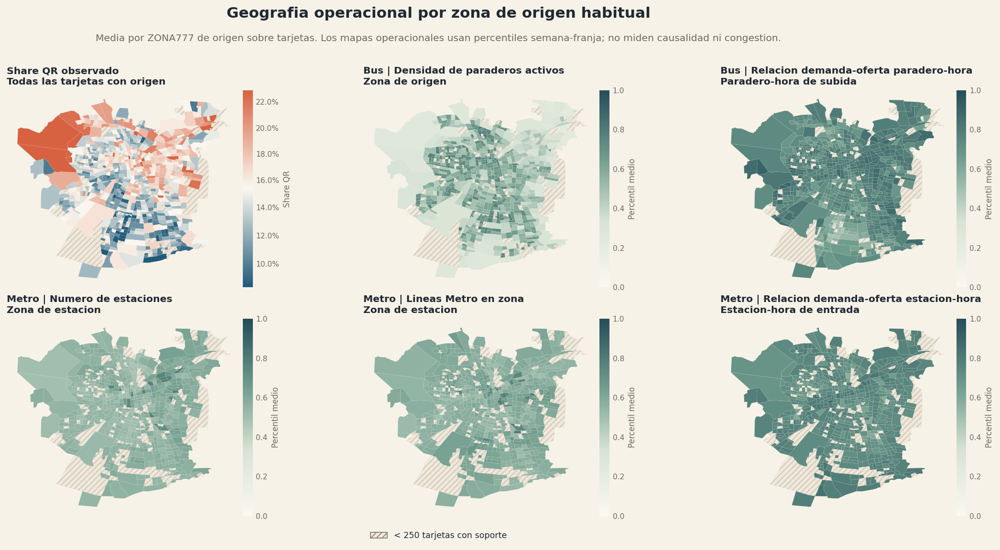
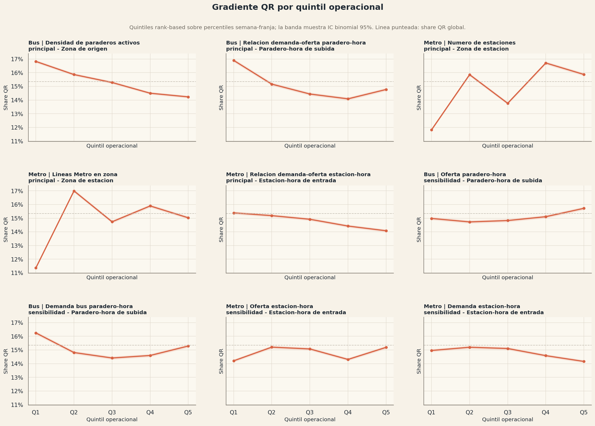

# Reporte breve EDA QR vs BIP

Este reporte resume los principales hallazgos descriptivos del notebook de EDA
QR vs BIP. En los bloques 1-14, la unidad principal de analisis es la tarjeta
observada (`id_tarjeta`), no una persona unica. En el cierre interanual se pasa a
una lectura por ZONA777 para comparar el cambio del share QR entre 2024 y 2025.
Por lo tanto, las diferencias se interpretan como diferencias entre
tarjetas/poblaciones observadas y zonas, no necesariamente como diferencias
individuales causales.

## 1. Composicion: cuantas tarjetas y viajes son BIP vs QR?

El universo analizado contiene 2.460.264 tarjetas y 43.647.285 viajes. Dentro de
ese total, QR representa 377.495 tarjetas, equivalente a 15,3% de las tarjetas
observadas. BIP concentra las 2.082.769 tarjetas restantes, equivalente a 84,7%.

La participacion de QR es algo menor cuando se mide en viajes: 5.956.451 viajes
QR, equivalentes a 13,6% del total. BIP concentra 37.690.834 viajes, equivalentes
a 86,4%. Es decir, QR pesa 1,7 puntos porcentuales menos en viajes que en
tarjetas.

## 2. Cohorte temporal: QR aparece mas en 2025 que BIP?

La composicion temporal muestra una diferencia clara entre grupos de pago. Entre
las tarjetas QR, 41,3% aparece solo en 2025, 33,6% aparece tanto en 2024 como en
2025, y 25,1% aparece solo en 2024. En BIP, en cambio, 33,9% aparece solo en
2025, 27,5% aparece en ambos anos y 38,6% aparece solo en 2024.

La respuesta descriptiva es si: QR esta mas cargado hacia 2025. La proporcion de
tarjetas `only_2025` es 7,3 puntos porcentuales mayor en QR que en BIP. Al mismo
tiempo, QR tiene menos tarjetas `only_2024` que BIP, con una diferencia de 13,5
puntos porcentuales.

Esto sugiere que parte de la diferencia QR/BIP puede estar asociada a entrada o
mayor presencia reciente en el sistema. Por eso, las comparaciones posteriores no
deberian leerse solo como diferencias entre medios de pago: tambien pueden
reflejar composicion temporal. En el resto del analisis conviene mantener
controles o sensibilidades por cohorte, especialmente al comparar intensidad de
uso, regularidad y variables territoriales.

## 3. Intensidad de uso: QR tiene mas o menos viajes, dias activos y semanas activas?

La primera comparacion de intensidad muestra que las tarjetas QR son menos
intensivas que las BIP en las dos medidas principales de uso: numero de viajes y
dias activos. La mediana de viajes por tarjeta es 8 en QR y 11 en BIP, una
diferencia de -3 viajes. La mediana de dias activos es 5 en QR y 6 en BIP, una
diferencia de -1 dia activo.

En semanas activas, en cambio, la diferencia central es mucho mas debil: ambos
grupos tienen mediana 3. Esto sugiere que QR no necesariamente aparece en menos
semanas observadas, sino con menor intensidad dentro de esas semanas o dias de
uso.

El perfil de percentiles confirma que la menor intensidad QR no aparece solo en
la mediana. En viajes, QR esta por debajo de BIP en p25, p50, p75 y p90: 4, 8,
21 y 38 viajes en QR versus 5, 11, 26 y 43 en BIP. En dias activos ocurre algo
similar: 2, 5, 11 y 19 dias en QR versus 3, 6, 14 y 21 en BIP.

La diferencia en semanas activas es menor. QR y BIP coinciden en p25, p50 y p75
con 2, 3 y 4 semanas activas, y solo se separan en p90: 6 semanas en QR versus
7 en BIP. Por lo tanto, la brecha principal no parece ser de presencia temporal
semanal, sino de cantidad de viajes y dias de uso.

Las medias van en la misma direccion que las medianas: BIP promedia 18,1 viajes
por tarjeta versus 15,8 en QR, y 9,1 dias activos versus 8,0 en QR. Esto indica
que la diferencia no depende solo de usuarios extremos. Aun asi, los rangos
intercuartil se solapan fuertemente, especialmente en semanas activas. La
conclusion debe leerse como una diferencia agregada entre grupos, no como una
separacion clara tarjeta a tarjeta.

## 4. Regularidad y concentracion de uso: QR es mas esporadico o mas rutinario que BIP?

En este bloque separamos dos ideas. La primera es la regularidad temporal: en
cuantos dias distintos aparece una tarjeta. La segunda es la concentracion de
uso: cuantos viajes realiza en los dias en que efectivamente aparece. Para este
reporte dejamos fuera las variables `routine_*`, porque agregan muchas
definiciones especificas y no son necesarias para responder la pregunta central
de este bloque.

La distribucion acumulada muestra que QR tiene una regularidad temporal menor
que BIP. En dias activos, la curva QR queda mas arriba y a la izquierda que la
curva BIP, lo que significa que una mayor proporcion de tarjetas QR se acumula
en valores bajos de dias de uso. La mediana es 5 dias activos en QR y 6 en BIP.

En cambio, la concentracion por dia activo es muy similar entre ambos medios de
pago. Tanto QR como BIP tienen mediana de 2 viajes por dia activo, y las curvas
de viajes por dia activo estan casi superpuestas. Esto sugiere que la diferencia
principal no esta en cuantos viajes hacen cuando aparecen, sino en la cantidad
de dias distintos en que aparecen.

Los umbrales interpretables refuerzan la misma lectura. QR tiene mayor presencia
en baja regularidad temporal: 41,3% de las tarjetas QR tiene hasta 3 dias
activos, versus 35,9% en BIP; y 55,0% tiene hasta 5 dias activos, versus 48,8%
en BIP. En el extremo de mayor regularidad ocurre lo contrario: 29,4% de QR
tiene al menos 10 dias activos, versus 35,7% en BIP; y 9,4% tiene al menos 20
dias activos, versus 12,1% en BIP.

La concentracion de viajes por dia activo, en cambio, practicamente no separa a
los grupos. El porcentaje con al menos 3 viajes por dia activo es 8,2% tanto en
BIP como en QR, y el porcentaje con al menos 4 viajes por dia activo es 1,5% en
BIP y 1,4% en QR. Por lo tanto, QR no parece ser mas concentrado en los dias en
que se usa.

La visual comunicacional resume el resultado: QR aparece en menos dias, pero
cuando aparece tiene una intensidad diaria parecida a BIP. Esto es consistente
con el bloque anterior de intensidad: QR es menos intensivo y menos regular en
terminos temporales, pero no necesariamente representa tarjetas que realizan mas
viajes concentrados en pocos dias. La diferencia parece venir principalmente de
menor frecuencia de aparicion en el periodo observado.

## 5. Horario: QR tiene un patron horario distinto a BIP?

Este bloque mira si las tarjetas QR aparecen en horarios distintos a las BIP.
Usamos cuatro lecturas complementarias: la hora promedio de los viajes de cada
tarjeta (`hora_mean`), la hora promedio del ultimo viaje diario
(`last_trip_hour_mean`), la distribucion horaria de viajes y la composicion por
franjas horarias.

La primera lectura es que QR tiene un desplazamiento horario leve hacia mas
tarde. La mediana de `hora_mean` es 13,1 en QR y 12,8 en BIP. En el ultimo viaje
diario, la diferencia es algo mayor: la mediana de `last_trip_hour_mean` es 16,0
en QR y 15,4 en BIP. Esto sugiere que, en promedio, los dias activos QR tienden
a cerrar un poco mas tarde.

La diferencia, sin embargo, no implica dos patrones horarios completamente
separados. Las distribuciones son bastante parecidas y comparten la estructura
general del dia: concentracion en torno al mediodia para `hora_mean` y mayor
masa durante la tarde para el ultimo viaje diario.

A nivel de viajes, ambas curvas muestran los mismos grandes bloques horarios:
punta de manana, valle laboral y punta de tarde. QR aparece algo mas alto en los
tramos de punta, especialmente hacia la tarde, y algo mas bajo en el valle
laboral. Por lo tanto, la diferencia parece ser de intensidad relativa dentro
del mismo patron diario, no de presencia en horarios completamente distintos.

La lectura a nivel tarjeta refuerza ese punto. La proporcion de tarjetas con al
menos un viaje por hora tiene una forma muy similar en BIP y QR. BIP tiende a
mostrar mayor presencia relativa en varias horas del valle laboral, mientras QR
se acerca o supera a BIP en algunos tramos de punta y horarios mas tardios. Esto
es consistente con el desplazamiento horario observado en las medianas.

La composicion por franjas resume el resultado con mayor claridad. QR tiene
mayor share promedio por tarjeta en punta manana laboral (19,8% versus 18,4%,
+1,4 pp), punta tarde laboral (13,3% versus 11,3%, +2,0 pp) y no laboral (15,9%
versus 14,5%, +1,4 pp). En cambio, QR tiene menor peso en valle laboral: 51,0%
versus 55,7% en BIP, una diferencia de -4,7 pp.

En sintesis, QR si muestra un patron horario algo distinto, pero no radicalmente
distinto. Las tarjetas QR se observan levemente mas tarde y con mayor peso
relativo en puntas y horarios no laborales, mientras BIP mantiene mayor
participacion en el valle laboral. Esta diferencia puede estar vinculada a la
menor regularidad temporal y menor intensidad total observadas en los bloques
anteriores, por lo que no debe interpretarse aisladamente como un efecto propio
del medio de pago.

## 6. Dia de semana: las tarjetas BIP y QR viajan los mismos dias?

Este bloque compara dos cosas distintas. Primero, el share de viajes por dia de
semana dentro de cada grupo de pago. Segundo, el porcentaje de tarjetas de cada
grupo que aparece al menos una vez en cada dia. La primera lectura habla de la
distribucion del volumen de viajes; la segunda habla de presencia o exposicion
de tarjetas.

En volumen de viajes, BIP y QR tienen perfiles semanales muy parecidos. Ambos
grupos concentran la mayor parte de sus viajes entre martes, miercoles y jueves,
con menor participacion el fin de semana. Las diferencias por dia son pequenas:
QR tiene algo menos de participacion relativa en dias laborales y algo mas en
fin de semana.

La diferencia de fin de semana se observa especialmente en sabado y domingo. En
sabado, QR concentra 8,1% de sus viajes versus 7,4% en BIP. En domingo, QR
concentra 4,3% versus 3,7% en BIP. La brecha existe, pero es de baja magnitud:
no transforma el perfil QR en uno principalmente de fin de semana.

La lectura de tarjetas activas es distinta y refuerza lo visto en regularidad.
En dias laborales, una menor proporcion de tarjetas QR aparece al menos una vez.
Por ejemplo, el lunes aparece 57,6% de las tarjetas QR versus 62,2% de las BIP;
entre martes y jueves QR se ubica cerca de 62,8%-62,9%, mientras BIP esta cerca
de 66,6%-66,8%. En viernes ocurre algo similar: 58,8% en QR versus 63,2% en
BIP.

En fin de semana la brecha de tarjetas activas se reduce. El sabado QR aparece
en 38,2% de sus tarjetas versus 39,2% en BIP, y el domingo QR incluso queda
levemente por encima: 23,3% versus 23,0%. Esto sugiere que la menor presencia de
QR no es uniforme en toda la semana, sino que se concentra principalmente en los
dias laborales.

En sintesis, QR no tiene una distribucion semanal radicalmente distinta, pero si
muestra menor presencia relativa de tarjetas en dias laborales y un peso de
viajes algo mayor en fin de semana. Esto es consistente con los bloques
anteriores: QR es menos regular temporalmente y algo menos asociado al uso
laboral recurrente, aunque las diferencias semanales son moderadas.

## 7. Perfil modal: QR esta mas asociado a un perfil modal distinto que BIP?

Este bloque compara la composicion modal de las tarjetas. Nos concentramos en
tres componentes mutuamente excluyentes a nivel viaje: `solo_bus`, `solo_metro`
y `metro_bus`. El ultimo caso corresponde a viajes que combinan bus y metro
dentro del mismo viaje.

La primera lectura es que QR tiene una presencia algo mayor de perfiles
extremos de un solo modo. El 22,8% de las tarjetas QR tiene al menos 80% de sus
viajes en solo bus, versus 19,6% en BIP. En solo metro ocurre algo parecido:
38,1% de QR tiene al menos 80% de sus viajes en solo metro, versus 36,3% en BIP.

En cambio, QR aparece menos asociado a combinaciones bus+metro. El 61,4% de las
tarjetas QR no tiene ningun viaje `metro_bus`, versus 55,3% en BIP. En los
cortes de mezcla relevante ocurre lo mismo: 25,6% de QR tiene al menos 20% de
sus viajes combinando metro y bus, versus 30,4% en BIP; y 10,6% de QR tiene al
menos 50% `metro_bus`, versus 14,1% en BIP.

El perfil promedio por tarjeta confirma la misma direccion. QR tiene mayor
share promedio en solo bus (35,9% versus 34,0%, +1,9 pp) y en solo metro
(50,9% versus 49,7%, +1,2 pp). En cambio, QR tiene menor share promedio en
viajes `metro_bus`: 13,2% versus 16,3% en BIP, una diferencia de -3,1 pp.

La conclusion descriptiva es que QR no parece mas intermodal que BIP. Al
contrario, QR aparece levemente mas asociado a viajes de un solo modo y menos a
viajes combinados bus+metro. La brecha no es enorme, pero es consistente entre
los cortes de perfiles extremos y el promedio por tarjeta. Esto puede reflejar
diferencias de zonas servidas, acceso a metro, tipo de viaje o perfiles de
usuarios, por lo que no debe interpretarse por si solo como una preferencia
causal por modos simples.

## 8. Territorio: QR vive o suele iniciar sus viajes desde zonas distintas a BIP?

Este bloque mira diferencias territoriales sin controles. Se comparan dos
geografias: zona de residencia y zona de origen habitual. Para evitar duplicar
mapas con cortes similares, en los coropleticos ZONA777 se usa un unico umbral
de soporte: `min_n = 500` tarjetas por zona, tanto para residencia como para
origen habitual. Las zonas bajo ese soporte quedan achuradas y se mantienen solo
como contexto territorial.

A nivel de macrozona aparece una senal territorial clara. Por residencia, QR
esta por encima de su share global en Centro (18,0%, +2,7 pp) y Oriente (17,3%,
+2,0 pp). Suroriente queda cerca del promedio global (15,7%, +0,3 pp), mientras
que Norte, Externa/especial, Sur y Poniente quedan por debajo.

Por origen habitual, la lectura es parecida, aunque no identica. QR queda sobre
el promedio en Oriente (17,3%, +2,0 pp), Externa/especial (16,7%, +1,3 pp) y
Centro (16,2%, +0,9 pp). En cambio, Sur (14,1%, -1,2 pp) y Poniente (14,0%,
-1,3 pp) aparecen bajo el promedio global.

El mapa de residencia muestra heterogeneidad local, pero mantiene la misma
lectura general: hay zonas con mayor presencia relativa de QR en sectores
centro-oriente y algunas areas especificas, mientras varias zonas del sur y
poniente aparecen bajo el share global. El mapa de diferencia contra el promedio
global es mas informativo que el mapa de share absoluto, porque separa mejor las
zonas relativamente altas y bajas.

El mapa de origen habitual conserva un patron similar, pero no debe leerse como
una copia del de residencia. Algunas zonas cambian de intensidad porque el
origen habitual captura donde la tarjeta suele iniciar viajes, no necesariamente
donde vive. Aun asi, el contraste agregado sigue apuntando en la misma direccion:
mayor presencia relativa de QR en sectores centro-oriente y menor presencia
relativa en sectores sur/poniente.

La comparacion directa entre residencia y origen habitual confirma que ambas
geografias cuentan historias parecidas, pero no equivalentes. Los puntos se
concentran cerca de la diagonal y la correlacion entre deltas territoriales es
alta (r = 0,83), lo que indica que las zonas con mayor presencia relativa de QR
por residencia tienden tambien a aparecer altas por origen habitual. La mediana
del cambio absoluto entre ambas lecturas es 1,2 pp y el p90 llega a 3,4 pp.

La figura tambien muestra que hay excepciones relevantes. Los puntos lejos de la
diagonal corresponden a zonas donde cambiar de residencia a origen habitual
mueve la lectura territorial: arriba de la diagonal hay zonas con origen QR mas
alto que residencia; abajo de la diagonal ocurre lo contrario. Por eso conviene
mantener ambas geografias en el diagnostico, aunque para una lectura agregada
entreguen una conclusion similar.

Al resumir el cambio `origen habitual - residencia` por macrozona interna, las
diferencias mas claras aparecen en Centro y Suroriente. En Centro, el delta es
negativo (-1,6 pp), lo que indica que QR pesa mas cuando la zona se mira como
residencia que cuando se mira como origen habitual. En Suroriente ocurre algo
similar (-1,1 pp). En cambio, Norte (+0,4 pp), Poniente (+0,2 pp) y Oriente
(+0,1 pp) muestran diferencias positivas pequenas, es decir, algo mas de peso
QR al mirar origen habitual.

La distribucion zona-a-zona muestra que el promedio macrozonal esconde bastante
heterogeneidad interna. Incluso dentro de una misma macrozona hay zonas donde QR
pesa mas por origen habitual y otras donde pesa mas por residencia. Esto es
importante para la lectura del informe: las macrozonas sirven para resumir el
patron territorial, pero no reemplazan la lectura local cuando el objetivo es
identificar zonas especificas.

La conclusion parcial es que QR si tiene una geografia distinta a BIP. Esta
diferencia es visible tanto en residencia como en origen habitual, y aparece en
varios niveles de agregacion. La lectura sigue siendo descriptiva y sin
controles: no separa si el patron territorial se debe a ingreso, edad, acceso a
metro, intensidad de uso, cohortes 2025, disponibilidad de comercios/servicios o
adopcion tecnologica.

## 9. Socio-demografico residencial: QR proviene de zonas de mayor ingreso y educacion?

En este bloque la unidad de analisis sigue siendo la tarjeta. Cada tarjeta
hereda atributos socio-demograficos desde su `zona_hogar`. Para comunicar mejor
la lectura, se usan variables crudas del artefacto EOD 2012 por ZONA777:
concentracion D+E proxy, concentracion ABC1 proxy y percentil del ingreso
mediano historico. Esto evita confundir la variable estandarizada usada en la
matriz anterior, porque `res_eod2012_share_hogares_de_income_proxy_z` no mide
"mayor ingreso", sino concentracion D+E proxy estandarizada.

En este contexto, **D+E proxy** corresponde al porcentaje de hogares de la zona
aproximados como estratos D y E en la EOD 2012; se usa como indicador historico
de menor nivel socioeconomico residencial. **ABC1 proxy** corresponde al
porcentaje de hogares de la zona aproximados como ABC1; se usa como indicador
historico de mayor nivel socioeconomico residencial. La palabra "proxy" es
importante: no observamos el ingreso individual actual de cada tarjeta, sino una
caracteristica agregada de su zona de residencia.

La primera lectura es que QR aparece algo menos asociado a zonas residenciales
con alta concentracion D+E proxy. La mediana D+E es 43,7% en QR versus 46,7% en
BIP, una diferencia de -3,0 pp. La diferencia no separa completamente ambas
poblaciones, pero apunta en la direccion esperada si QR esta relativamente mas
presente en zonas de mayores recursos.

La segunda lectura va en el mismo sentido: QR tiene una concentracion ABC1 proxy
algo mayor. La mediana ABC1 es 4,9% en QR versus 4,0% en BIP, una diferencia de
+0,9 pp. La diferencia parece pequena en la mediana, pero tambien se observa en
la parte alta de la distribucion: el p75 ABC1 de QR llega a 14,6%, mientras que
en BIP llega a 11,6%.

El ranking de ingreso mediano historico resume la misma idea en una escala mas
directa. La tarjeta QR mediana queda en el percentil 56 de ingreso residencial,
mientras que la tarjeta BIP mediana queda en el percentil 51. La diferencia es
de +4,9 puntos percentil a favor de QR. Tambien hay una leve diferencia en los
rangos intercuartiles: QR va de p35 a p76, mientras BIP va de p31 a p73.

La tabla por quintiles refuerza esta lectura. El share QR aumenta desde 12,6%
en el quintil residencial de menor ingreso historico hasta 16,7% en el quintil
mas alto. En los quintiles intermedios, el share QR se ubica cerca de 14,9% a
16,4%. Esto sugiere un gradiente positivo, aunque moderado, entre ingreso
residencial historico y adopcion QR.

La conclusion descriptiva es que QR esta relativamente mas asociado a zonas de
residencia de mayor ingreso historico, menor concentracion D+E proxy y mayor
concentracion ABC1 proxy. Esta lectura es coherente con el bloque territorial:
la mayor presencia QR en sectores centro-oriente/nororiente puede reflejar
mayor adopcion tecnologica o bancarizacion en zonas de mayores recursos. Sin
embargo, no debe leerse como ingreso individual de la tarjeta ni como efecto
causal; es una caracteristica ecologica heredada desde la zona de residencia.

### Educacion residencial

La siguiente variable proviene del Censo 2024 y mide el porcentaje de poblacion
18+ con educacion universitaria o superior en la zona de residencia. La lectura
tambien es ecologica: describe el entorno residencial asociado a la tarjeta, no
la educacion individual del usuario.

La distribucion por tarjeta muestra una diferencia moderada en la misma
direccion que el ingreso historico. La tarjeta QR mediana reside en una zona con
23,4% de poblacion 18+ con educacion universitaria o superior, mientras que la
tarjeta BIP mediana reside en una zona con 21,6%. La diferencia es de +1,8 pp a
favor de QR.
El solapamiento entre distribuciones sigue siendo amplio, por lo que esta
variable no separa claramente ambas poblaciones tarjeta a tarjeta, pero si
desplaza la composicion QR hacia zonas algo mas educadas.

La lectura por quintiles es mas clara. El share QR pasa de 12,9% en los dos
quintiles de menor educacion residencial a 17,9% en el quintil de mayor
educacion, una diferencia Q5-Q1 de +5,1 pp. Ademas, los quintiles superiores
quedan por sobre el share QR global, mientras los quintiles inferiores quedan
por debajo. Esto sugiere un gradiente positivo entre educacion universitaria del
entorno residencial y adopcion QR.

La sensibilidad por definicion educativa ayuda a precisar la interpretacion. La
diferencia QR - BIP es similar cuando se usa "universitaria o mas" o
"universitaria" (+1,8 pp), pero casi desaparece para postgrado (+0,3 pp) y
terciaria corta (+0,1 pp). Por lo tanto, la senal no parece venir de cualquier
educacion terciaria ni exclusivamente de posgrado, sino de la presencia zonal de
educacion universitaria como marcador amplio de capital educativo residencial.

El cruce entre ingreso historico y educacion residencial muestra que ambos
gradientes no son equivalentes. Las celdas con mayor educacion residencial
tienden a presentar shares QR superiores al promedio global incluso cuando el
ingreso no esta en el quintil mas alto: por ejemplo, Q2 de ingreso y Q5 de
educacion alcanza 18,9%, Q3-Q5 alcanza 19,6% y Q4-Q5 alcanza 18,6%. En cambio,
algunas celdas de ingreso alto pero educacion no alta quedan cerca o por debajo
del promedio global, como Q5 de ingreso y Q2 de educacion con 13,3% o Q5 de
ingreso y Q4 de educacion con 14,4%.

La lectura mas defendible es que QR se asocia con entornos residenciales de
mayor capital socioeconomico y educativo, pero la dimension educativa parece
aportar informacion propia dentro del bloque socio-demografico. Las celdas con
soporte muy bajo deben leerse solo como referencia descriptiva; por ejemplo,
Q5 de ingreso y Q1 de educacion tiene apenas 237 tarjetas y Q1 de ingreso con
Q5 de educacion tiene 1.288 tarjetas.

### Edad y ciclo de vida residencial

La pregunta siguiente es si QR esta asociado a tarjetas que residen en zonas con
una estructura etaria mas joven o mas envejecida que BIP. Al igual que ingreso
y educacion, estas variables describen la composicion de `zona_hogar` y no la
edad individual de la persona usuaria de la tarjeta.

El tramo 18-24 requiere una lectura contextual. Una parte relevante de los
estudiantes jovenes usa Tarjeta Nacional Estudiantil, que en esta clasificacion
queda dentro de BIP. Por eso, si QR aparece mas asociado a zonas 25-44 que a
zonas 18-24, no necesariamente contradice una hipotesis de adopcion digital por
edad; puede reflejar que el grupo estudiantil joven esta institucionalmente
anclado a BIP.

En las medianas residenciales, 18-24 practicamente no diferencia QR de BIP:
ambos grupos heredan zonas con 9,6% de poblacion en ese tramo. La diferencia
aparece en el ciclo de vida adulto: QR reside en zonas con mayor presencia
25-44, con 31,8% versus 30,4% en BIP (+1,4 pp). En sentido inverso, QR reside
en zonas algo menos envejecidas: 18,8% de poblacion 60+ versus 20,0% en BIP
(-1,2 pp).

La distribucion completa confirma que estas diferencias son moderadas y con
alto solapamiento. No separan limpiamente a las tarjetas QR y BIP, pero sugieren
un desplazamiento composicional: QR pesa relativamente mas en entornos de adultos
en edad laboral y menos en entornos residenciales envejecidos.

El gradiente por quintiles hace mas clara la senal 25-44. El share QR sube de
14,0% en el quintil con menor presencia residencial 25-44 a 17,6% en el quintil
con mayor presencia 25-44, una diferencia Q5-Q1 de +3,6 pp. Los quintiles altos
quedan por sobre el share QR global, lo que refuerza la asociacion entre QR y
zonas con mayor peso de adultos en edad laboral.

El patron opuesto aparece con poblacion 60+. El share QR baja de 16,7% en el
quintil menos envejecido a 13,5% en el quintil mas envejecido, una diferencia
Q5-Q1 de -3,2 pp. En conjunto, la lectura descriptiva es que QR se concentra
relativamente mas en zonas residenciales de ciclo adulto-laboral y menos en
zonas envejecidas. Esta lectura sigue siendo ecologica y puede estar mezclando
edad residencial, ingreso, educacion, localizacion y estructura urbana.

## 10. Acceso fisico a carga BIP: QR aparece donde cargar BIP es mas dificil?

La pregunta de este bloque conecta directamente con una hipotesis de sustitucion:
si QR reduce la necesidad de cargar saldo fisicamente, entonces podria tener
mayor peso en zonas donde el acceso a puntos de carga BIP es peor. Para explorar
esto se usan variables crudas de infraestructura: distancia al punto BIP mas
cercano, densidad de puntos BIP y numero de puntos BIP en la zona.

La unidad de analisis sigue siendo la tarjeta. Cada tarjeta hereda estos
atributos desde su zona de residencia, origen habitual o actividad habitual. Por
lo tanto, las variables describen el entorno territorial de la tarjeta, no una
distancia exacta desde la vivienda ni desde cada paradero efectivamente usado.

La comparacion de medianas no muestra diferencias relevantes entre BIP y QR. En
distancia al punto BIP mas cercano, las medianas son practicamente iguales en
residencia, origen habitual y actividad habitual. Lo mismo ocurre con la
densidad de puntos BIP: las diferencias QR - BIP son cercanas a cero en las tres
geografias.

Esta primera lectura ya debilita la hipotesis simple de sustitucion por acceso
fisico: las tarjetas QR no parecen provenir, en la mediana, de entornos con
peor acceso territorial a carga BIP.

La lectura por quintiles tampoco muestra un gradiente en la direccion esperada.
Si QR sustituyera friccion de carga fisica, el share QR deberia aumentar al
pasar desde zonas mas cercanas a puntos BIP hacia zonas mas lejanas. Sin
embargo, el cambio Q5-Q1 es negativo en las tres geografias: -1,1 pp en
residencia, -0,6 pp en origen habitual y -0,4 pp en actividad habitual. Las
curvas fluctuan alrededor del share QR global, pero no muestran una relacion
monotona creciente con la distancia.

La densidad entrega una conclusion similar. Si la baja oferta de carga BIP
empujara adopcion QR, se esperaria mayor share QR en los quintiles de menor
densidad y menor share QR en los quintiles de mayor densidad. En cambio, las
diferencias Q5-Q1 son practicamente nulas: +0,1 pp en residencia, +0,1 pp en
origen habitual y -0,1 pp en actividad habitual. Tampoco aparece una forma
monotona clara.

En sintesis, con estas medidas zonales no aparece evidencia descriptiva fuerte
de que QR este asociado a peor acceso fisico a carga BIP. Esto no descarta que
la friccion de carga opere para subgrupos, horarios o recorridos especificos,
pero sugiere que, a escala ZONA777 y usando centroides/infraestructura zonal, el
acceso fisico a carga BIP no parece ser un driver principal de la adopcion QR.

## 11. Infraestructura financiera fisica OSM: QR aparece mas en zonas con bancos y cajeros?

Este bloque usa OpenStreetMap para aproximar presencia fisica de infraestructura
financiera: bancos, cajeros automaticos y casas de cambio (`amenity=bank`,
`amenity=atm`, `amenity=bureau_de_change`). La variable se construye a escala
ZONA777 como densidad de objetos OSM por km2, transformada con `log1p`,
winsorizada y estandarizada como indice zonal.

La transformacion se usa porque estas densidades son muy asimetricas: muchas
zonas tienen cero o pocos puntos financieros y pocas zonas centrales concentran
valores muy altos. `log1p` reduce el peso de esas colas, la winsorizacion limita
outliers y el z-score permite leer el resultado como presencia financiera
relativa respecto de la zona tipica.

La lectura debe ser acotada. Esta variable no mide bancarizacion individual,
uso de cuentas bancarias, acceso digital ni disponibilidad real de medios de
pago. Solo indica si el entorno territorial de la tarjeta tiene mayor o menor
presencia fisica de infraestructura financiera registrada en OSM.

El mapa confirma que la infraestructura financiera OSM esta espacialmente
concentrada. La mayor presencia aparece en zonas centrales y en ejes de alta
actividad, mientras muchas zonas perifericas quedan con baja o nula presencia.
Por eso, antes de interpretar el indice como "infraestructura financiera", hay
que recordar que tambien captura centralidad urbana y equipamiento territorial.

Esto se ve en las correlaciones del bloque: el indice financiero OSM se asocia
positivamente con educacion universitaria residencial y con presencia de
poblacion 25-44, y negativamente con concentracion D+E y poblacion 60+. En
otras palabras, no es una variable aislada; esta mezclada con composicion
socio-territorial y ciclo de vida urbano.

Al separar zonas con y sin presencia financiera, QR aparece algo mas en zonas
con infraestructura financiera. En residencia, el share QR es 15,9% cuando la
zona tiene presencia financiera versus 14,5% cuando no la tiene. En origen
habitual, el patron es similar: 15,7% versus 14,6%. La diferencia existe, pero
es moderada y no debe leerse como efecto causal.

La lectura por quintiles refuerza esa cautela. El gradiente es positivo pero
suave: Q5-Q1 es +1,6 pp en residencia y +1,5 pp en origen habitual. Ademas, el
patron no es perfectamente monotono. Esto sugiere que la infraestructura
financiera OSM ayuda a describir entornos donde QR pesa mas, pero no separa de
manera fuerte a las tarjetas QR y BIP.

El cruce residencia-origen muestra el mismo mensaje. El caso con menor share QR
es cuando residencia y origen no tienen infraestructura financiera OSM (14,1%).
El caso con infraestructura tanto en residencia como en origen llega a 15,9%,
con el mayor soporte de tarjetas. La celda mas alta es residencia con
infraestructura y origen sin infraestructura (16,5%), pero tiene bastante menos
soporte y debe leerse como una pista descriptiva, no como resultado central.

En sintesis, la infraestructura financiera fisica OSM parece util como variable
de contexto territorial: QR pesa algo mas en zonas mas equipadas, centrales y
con mayor presencia de infraestructura financiera. Sin embargo, este bloque no
apoya una lectura mecanica de "mas bancos/cajeros causan mas QR". La variable
esta fuertemente entrelazada con centralidad, educacion residencial, estructura
etaria y macrozona. Su uso mas defendible es como descriptor territorial o como
control/sensibilidad, no como mecanismo principal de adopcion QR.

## 12. Comercio y servicios cotidianos OSM: QR aparece mas en zonas con mayor centralidad local?

Este segundo bloque OSM mira comercio y servicios cotidianos registrados en
OpenStreetMap. La familia incluye `shop=*` y amenities de consumo cotidiano
como restaurantes, cafes, comida rapida, bares, pubs, food courts, mercados y
farmacias. No incluye `office=*`, para no mezclar comercio local con actividad
laboral u oficinas.

La variable se construye como densidad de objetos OSM por km2 a escala ZONA777,
transformada con `log1p`, winsorizada al p99.5 y estandarizada como z-score
zonal. La razon es la misma que en el indice financiero: muchas zonas tienen
pocos objetos y unas pocas zonas centrales concentran valores muy altos. La
transformacion permite leer el indice como comercio/servicios relativos frente
a la zona tipica.

La lectura debe ser acotada. Esta familia no mide acceso digital,
bancarizacion, capacidad de pago ni disposicion a usar QR. Se interpreta como
un proxy territorial de centralidad local y disponibilidad de servicios
cotidianos alrededor de la residencia u origen habitual de la tarjeta.

El mapa muestra una estructura espacial esperable: el comercio y los servicios
cotidianos se concentran en el centro y en subcentralidades o ejes urbanos. El
indice transformado destaca esas zonas con valores positivos y deja muchas
zonas perifericas con valores negativos. Por eso, igual que con infraestructura
financiera, el indice no debe leerse como una variable aislada: tambien resume
centralidad urbana.

La presencia binaria aporta poca separacion porque casi todas las tarjetas
estan asociadas a zonas con algun comercio o servicio OSM: 97,8% en residencia
y 98,5% en origen habitual. Las zonas cubiertas sin presencia son pequenas
en soporte y muestran menor share QR, alrededor de 13,1%. El grupo sin valor o
missing tiene share QR alto, pero representa solo 0,2%-0,3% de las tarjetas, por
lo que no conviene interpretarlo como resultado sustantivo.

La lectura por quintiles sugiere una asociacion positiva, pero no un gradiente
limpio ni estrictamente monotono. En residencia, el share QR pasa de 14,1% en el
quintil de menor comercio a 17,1% en el de mayor comercio, con una caida local
en Q3. En origen habitual, el patron es mas irregular: Q1 tiene 14,7%, Q2 baja
a 14,2%, Q4 llega a 16,5% y Q5 queda en 16,3%.

Esta senal esta mezclada con composicion socio-territorial. El indice de
comercio/servicios se correlaciona positivamente con educacion universitaria
residencial y con poblacion 25-44, y negativamente con concentracion D+E y
poblacion 60+. En otras palabras, las zonas con mas comercio OSM tambien tienden
a ser zonas mas centrales, con poblacion mas joven adulta y mayor capital
educativo.

En sintesis, comercio y servicios OSM describen entornos donde QR pesa algo mas,
pero no entregan evidencia de un mecanismo independiente de adopcion QR. La
interpretacion mas defendible es que capturan centralidad local y composicion
socio-demografica favorable a QR. Esta variable es util como descriptor
territorial, control o sensibilidad; no como resultado sustantivo principal por
si sola.

## 13. Objetos urbanos OSM no comerciales: QR aparece mas en zonas con escuelas, salud o parques?

Este bloque revisa si QR aparece con mayor peso en tarjetas asociadas a zonas
con mas objetos urbanos registrados en OpenStreetMap que no son comercio,
servicios financieros ni infraestructura de transporte. En concreto, se agrupan
siete componentes: escuelas; educacion superior; salud general; centros civicos
barriales; parques; juegos infantiles; y canchas o centros deportivos barriales.
Cada componente se mide como densidad zonal de objetos OSM por km2.

Cuando el texto dice que una tarjeta "hereda" un componente, significa que a la
tarjeta se le asigna el valor de su zona de residencia o de su origen habitual.
No significa que la persona use esos objetos ni que viva cerca de un objeto
especifico. Estas variables no miden calidad, capacidad, demanda, uso efectivo
ni acceso individual.

La primera decision metodologica es no construir un indice agregado que mezcle
todos estos objetos. Una escuela, una clinica, un parque, un centro comunitario
y una cancha representan objetos urbanos distintos. Mezclarlos en un unico
indice haria mas dificil interpretar cualquier diferencia QR/BIP.

El mapa ayuda a leer el bloque antes de comparar QR y BIP. Muestra, para cada
tipo de objeto, las zonas con intensidad alta: rojo indica zonas sobre +1
desviacion estandar del indice zonal transformado y rojo oscuro zonas sobre +2.
Las zonas achuradas no tienen presencia OSM del componente. Por eso, la figura
no debe leerse como una escala continua completa ni como un resultado de
adopcion QR; su funcion es mostrar que los componentes tienen geografias
distintas.

La lectura espacial refuerza la decision de no agregar todo en un unico indice.
Educacion superior y centros comunitarios aparecen mas concentrados en
centralidades especificas; escuelas, salud general, juegos infantiles y canchas
o recintos deportivos tienen una distribucion mas dispersa; parques combinan
zonas concentradas con presencia irregular. En otras palabras, cada fila habla
de un tipo de objeto urbano distinto, no de una nocion unica de "mejor
dotacion urbana".

La figura resume la diferencia QR - BIP en la mediana del indice z heredado por
tarjeta. Cada fila es un tipo de objeto OSM: escuelas (`amenity=school`),
educacion superior (`amenity=university/college`), salud general
(`amenity=clinic/doctors/dentist`), centros comunitarios
(`amenity=community_centre`), parques (`leisure=park`), juegos infantiles
(`leisure=playground`) y canchas o centros deportivos
(`leisure=pitch/sports_centre`).
El eje horizontal esta centrado en cero: valores positivos indican que las
tarjetas QR heredan zonas con mayor intensidad OSM de ese componente; valores
negativos indican mayor intensidad heredada por BIP.

El resultado principal es que no aparece una separacion fuerte entre QR y BIP.
En residencia, la mayor diferencia favorable a QR esta en salud general
(+0,10 z), mientras que escuelas queda cerca de cero (+0,02 z), educacion
superior y centros comunitarios no separan en la mediana, y canchas/centros
deportivos aparecen levemente mas asociados a BIP (-0,04 z). En origen habitual
se repite una senal moderada en salud general (+0,11 z) y aparece tambien
juegos infantiles (+0,09 z), pero ambas diferencias siguen alrededor de una
decima de desviacion estandar.

Por lo tanto, este bloque no sostiene una historia general de "mas objetos
urbanos OSM, mas QR". Su lectura mas defendible es descriptiva: las tarjetas QR
estan asociadas a zonas apenas mas intensas en algunos objetos OSM de salud y,
para origen habitual, juegos infantiles. Educacion superior y centros
comunitarios son componentes territorialmente concentrados, pero no separan a QR
y BIP en la mediana heredada. El bloque sirve para describir el contexto urbano
registrado en OSM alrededor de las zonas asociadas a las tarjetas, no como una
senal fuerte de adopcion QR ni como mecanismo independiente.

## Nota metodologica sobre infraestructura de transporte OSM

Tambien se audito infraestructura fisica de transporte registrada en OSM:
paraderos, plataformas, accesos a Metro, refugios y otros elementos de espera.
No se incorpora como bloque principal del informe porque OSM registra objetos
fisicos, pero no mide oferta operacional, frecuencias, lineas, salidas por hora
ni demanda observada. Ese componente queda mejor cubierto por el bloque
posterior de oferta/demanda operacional.

Ademas, los gradientes QR/BIP observados con estas variables no fueron claros ni
monotonos. Por eso, transporte OSM se interpreta solo como una auditoria
metodologica y, eventualmente, como control descriptivo o sensibilidad; no como
evidencia sustantiva sobre adopcion QR.

## 14. Contexto operacional reconstruido: QR aparece en zonas de origen con distinta oferta, demanda o presion?

Este bloque reemplaza la lectura de infraestructura fisica OSM de transporte por
variables operacionales reconstruidas desde viajes observados, frecuencias bus y
oferta programada Metro. La unidad de lectura sigue siendo la tarjeta: a cada
tarjeta se le asigna el promedio de los contextos operacionales que observa en
sus viajes, principalmente desde su zona de origen habitual.

Las variables no miden calidad de servicio ni experiencia individual. En bus,
**oferta** refiere a pasadas/frecuencias o presencia de paraderos activos en el
contexto de origen; **demanda** refiere a subidas o viajes observados en el mismo
contexto; y **presion** es una relacion demanda/oferta, por ejemplo subidas por
pasada programada o equivalente en un paradero-hora. En Metro, **oferta** se
aproxima con estaciones, lineas o trenes programados por estacion/franja;
**demanda** son entradas Metro observadas; y **presion** son entradas por pasada
tren-estacion programada. Ninguna de estas variables mide ocupacion, capacidad,
congestion, espera real ni causalidad.

Para hacer comparables semanas y franjas horarias, las variables operacionales se
trabajan principalmente como percentiles dentro de cada semana-franja. Luego se
promedian sobre los viajes de cada tarjeta. En los mapas, el valor mostrado es
el promedio de tarjetas asociadas a cada zona de origen habitual. En los
gradientes, los quintiles son grupos rank-based de tarjetas, no cortes naturales
de infraestructura.

El mapa muestra que las variables operacionales tienen una estructura espacial
marcada. La densidad de paraderos activos, la relacion demanda/oferta bus y la
presencia Metro no se distribuyen igual en la ciudad. Esto es importante para la
lectura: cualquier gradiente QR/BIP mezcla condiciones operacionales con
estructura territorial del origen habitual. Por eso, el mapa se usa como
contexto espacial, no como prueba de un mecanismo de adopcion.

La comparacion por quintiles no entrega una historia simple de "mas oferta, mas
QR". En los contextos bus, QR tiende a pesar menos cuando aumenta la intensidad
operacional. La densidad de paraderos activos baja de aproximadamente 16,8% QR
en Q1 a 14,2% en Q5. La relacion demanda/oferta bus tambien cae desde el primer
quintil y queda bajo el share QR global en los quintiles mas altos. Es decir, QR
no parece concentrarse en zonas de origen con mayor densidad o presion bus.

La senal Metro apunta en otra direccion. Las tarjetas QR aparecen relativamente
mas en zonas con mayor presencia Metro, especialmente cuando la variable es
numero de estaciones o lineas en la zona. Sin embargo, el patron no es un
gradiente fino perfectamente monotono: parece mas una diferencia entre zonas con
baja o nula presencia Metro y zonas con presencia Metro. La relacion
demanda/oferta Metro, en cambio, no muestra una senal positiva clara para QR.

En sintesis, el bloque operacional describe una diferencia de contexto: QR se
asocia menos a entornos bus densos o presionados, y algo mas a zonas con
presencia Metro. Esta lectura es descriptiva y territorial. No implica que la
oferta bus reduzca QR ni que Metro cause adopcion QR; mas probablemente combina
patrones de origen habitual, centralidad, estructura modal y composicion de los
usuarios.

## 15. Cambio interanual zonal: donde crece QR entre 2024 y 2025?

Este bloque pregunta si la expansion de QR entre 2024 y 2025 fue territorialmente
homogenea o si hubo zonas donde crecio mas que la tendencia global. La
comparacion usa ventanas equivalentes de cuatro semanas en cada ano
(`2024-W14` a `2024-W17` y `2025-W14` a `2025-W17`). Por eso, no debe leerse como
un balance anual completo, sino como una comparacion interanual controlada por
semana calendario.

Se usan dos geografias. En **residencia**, la unidad es tarjeta-ano clasificada
como QR o BIP y agrupada por `zona_hogar`. En **origen de viaje**, la unidad es
viaje iniciado en la zona. En ambos casos, el delta zonal es:

`share QR 2025 - share QR 2024`, medido en puntos porcentuales.

Cuando se habla de crecimiento relativo, se resta el cambio global de la misma
geografia:

`delta relativo = delta zonal - delta global`.

Asi, un valor positivo no significa simplemente que QR subio, sino que subio mas
que la tendencia global de esa geografia.

La primera lectura es de expansion generalizada. En residencia, el share QR sube
de 13,9% en 2024 a 18,1% en 2025, con un aumento global de +4,22 pp. En origen
de viaje, sube de 12,8% a 16,8%, con un aumento de +3,96 pp. La gran mayoria de
las zonas con soporte comparable aumenta su share QR: 99,7% en residencia y
99,5% en origen de viaje.

Esto implica que el fenomeno interanual no es la aparicion aislada de QR en unas
pocas zonas. QR crece casi en toda la ciudad. La pregunta sustantiva pasa a ser
otra: donde crece mas o menos que la tendencia global.

La geografia del uso QR es muy persistente entre anos. La correlacion ponderada
entre el share QR zonal de 2024 y 2025 es 0,96 en residencia y 0,97 en origen de
viaje. Es decir, las zonas que ya tenian mas QR en 2024 tienden a seguir arriba
en 2025.

Ademas, hay una senal de refuerzo territorial mas que de convergencia. El nivel
QR inicial se asocia positivamente con el crecimiento relativo: +0,27 en
residencia y +0,44 en origen de viaje. En terminos simples, varias zonas que ya
partian con mayor QR tambien crecieron mas que el promedio global. Al mismo
tiempo, no todas las zonas altas son top de crecimiento: 45,6% de las zonas de
residencia y 37,5% de las zonas de origen crecen sobre la tendencia global. Por
eso, el delta relativo ayuda a separar nivel inicial de dinamica interanual.

El screening de variables candidatas sugiere asociaciones descriptivas, no un
modelo causal. En residencia, el crecimiento relativo QR es mayor en zonas con
mas educacion universitaria+ residencial y menor en zonas con mayor
concentracion D+E. La educacion universitaria+ muestra la senal residencial mas
consistente: correlacion Spearman con delta de +0,30, correlacion parcial
controlando share QR 2024 de +0,23, y diferencia Q5-Q1 de +1,33 pp. La
concentracion D+E va en sentido opuesto: -0,20, -0,14 y -0,91 pp,
respectivamente.

Las variables OSM de centralidad urbana, como comercio/servicios e
infraestructura financiera, muestran senales positivas moderadas. En origen de
viaje, las variables operacionales mas informativas son presencia Metro y
demanda bus: el numero de estaciones Metro tiene correlacion Spearman con delta
de +0,25, partial corr de +0,22 y diferencia Q5-Q1 de +0,82 pp; la demanda bus
tambien es positiva, aunque mas moderada. En cambio, el acceso fisico a carga BIP
se mantiene como control de senal debil: no aparece como una explicacion fuerte
del crecimiento interanual QR.

La lectura por zonas top/bottom no basta, porque una zona puede crecer mucho en
tasa pero aportar poco volumen. Por eso se separa la contribucion al aumento de
share de QR:

`observaciones 2025 * (share QR 2025 - share QR 2024)`.

En residencia, el mayor aporte volumetrico al aumento QR proviene de Poniente
(25,6%), Suroriente (20,6%) y Oriente (18,8%). En origen de viaje, el mayor
aporte proviene de Oriente (29,8%), Centro (18,7%), Poniente (18,3%) y
Suroriente (17,2%). Esta diferencia es importante: territorialmente, Oriente
aparece como zona de alto crecimiento relativo y alto aporte en origen de viaje;
pero en residencia el aporte agregado se reparte mas entre Poniente, Suroriente y
Oriente por el volumen observado.

El componente top 20% tampoco explica todo el aumento. En residencia, el middle
60% de zonas aporta 77,5% del aumento de share, el top 20% aporta 15,7% y el
bottom 20% aporta 5,1%. En origen de viaje, el top 20% pesa mas, con 34,2% del
aporte, pero el middle 60% sigue concentrando 61,7%. La expansion QR, por tanto,
combina crecimiento amplio de base con algunos focos de crecimiento relativo mas
marcado.

La sensibilidad minima no cambia la lectura principal. Al variar el umbral de
soporte por ano entre 100, 250 y 500 observaciones, y al redefinir top/bottom
como 15%, 20% o 25%, la persistencia 2024-2025 se mantiene alta, la asociacion
entre nivel inicial y crecimiento relativo conserva el mismo signo, y las
macrozonas externas no alteran el ranking de aportes principales. Esto no prueba
causalidad, pero si da confianza en que las conclusiones descriptivas no dependen
de un unico corte arbitrario.

En sintesis, el bloque interanual muestra tres cosas. Primero, QR crece de forma
amplia entre las ventanas equivalentes de 2024 y 2025. Segundo, la geografia QR
es persistente: las zonas que ya tenian mayor QR siguen concentrando mayor QR y,
en varios casos, crecen mas que la tendencia global. Tercero, las senales
territoriales que mejor acompanian ese crecimiento son composicion
socioeconomica residencial, centralidad urbana y presencia operacional Metro/bus,
mientras que el acceso fisico a carga BIP no aparece como explicacion dominante.

## Cierre del reporte

El EDA describe un patron coherente pero no causal. QR representa una fraccion
menor del sistema que BIP, pesa menos en viajes que en tarjetas y muestra menor
intensidad y regularidad de uso. Su perfil horario, semanal y modal no es
radicalmente distinto, pero si aparece algo mas desplazado hacia usos no
laborales, fin de semana y viajes unimodales.

En la dimension territorial y sociodemografica, QR se asocia mas con zonas de
mayor ingreso/educacion residencial, mayor presencia de poblacion adulta joven,
centralidad urbana y presencia Metro. No aparece evidencia clara de que QR crezca
principalmente donde la red fisica de carga BIP es peor. Las variables OSM y
operacionales son utiles para describir contexto urbano, pero no deben leerse
como mecanismos independientes de adopcion.

La extension interanual agrega una pieza clave: QR no solo esta mas presente en
2025, sino que crece casi en todas las zonas comparables. Sin embargo, ese
crecimiento no borra la geografia previa; mas bien conserva y en parte refuerza
las diferencias territoriales iniciales. Esto deja una base razonable para un
segundo EDA o un modelo zonal de crecimiento QR, siempre que el modelo controle
por share QR inicial, soporte/volumen, macrozona y familias de variables
territoriales.
