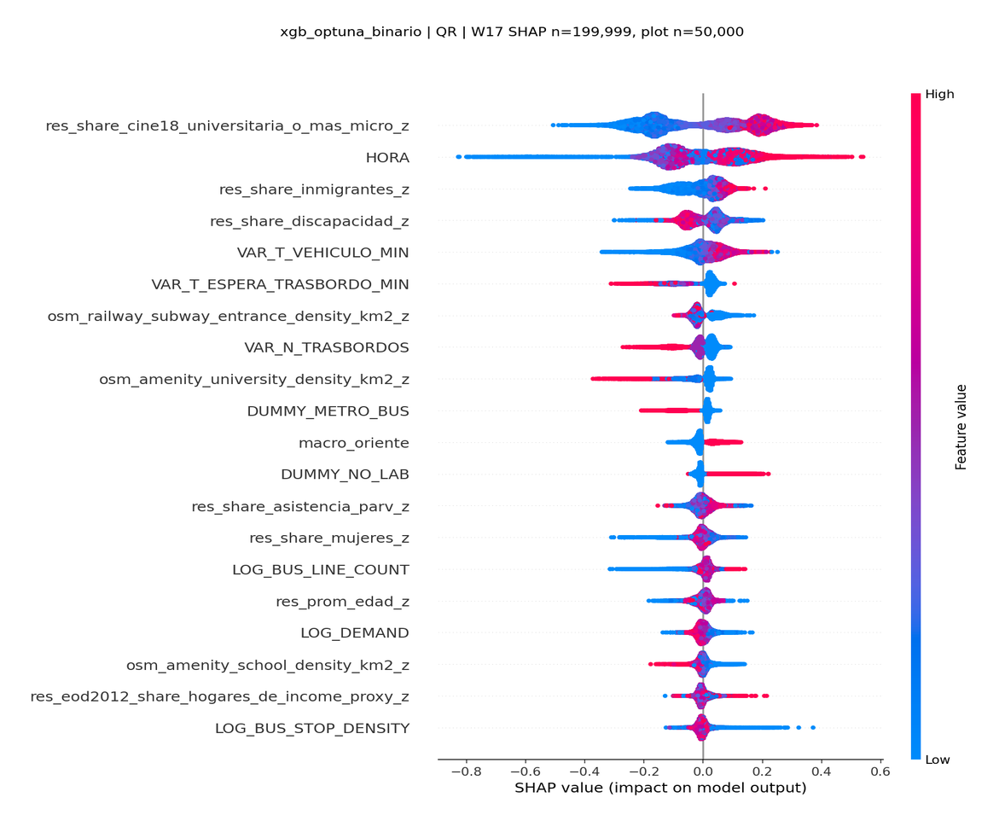
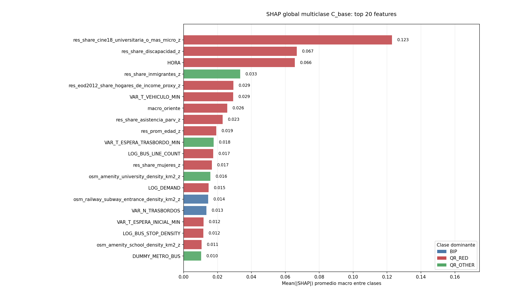
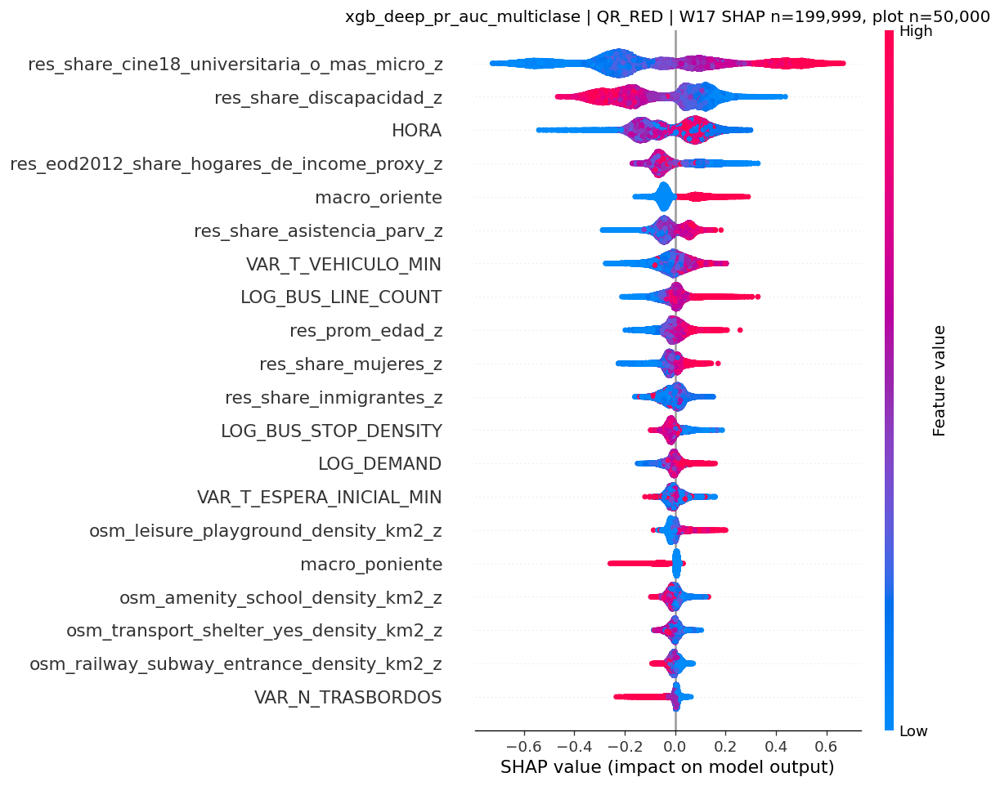
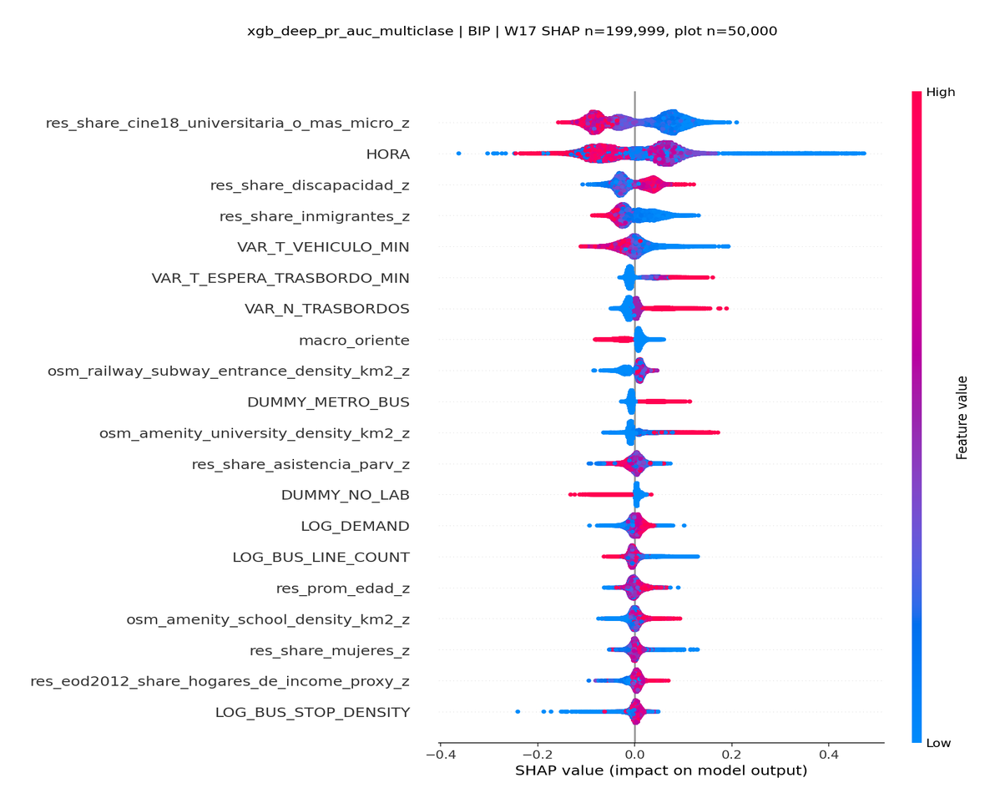
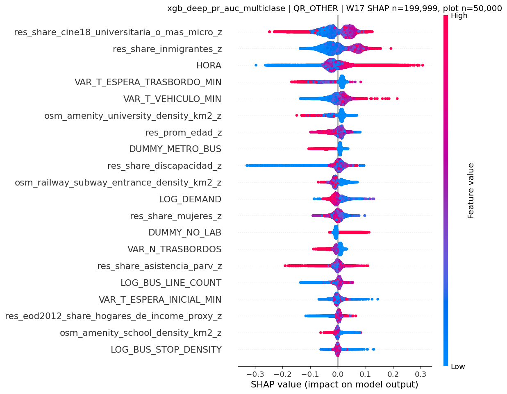

# Avance frente ML: modelo predictivo e interpretabilidad

## 1. Objetivo

El frente ML se usa como complemento del modelo econometrico: busca evaluar si un modelo flexible captura patrones no lineales en el uso de QR y si sus variables relevantes son consistentes con la lectura del MNL.

El modelo busca predecir, para cada viaje individual, si el medio de pago observado corresponde a BIP o QR; en la version multiclase, distingue ademas entre QR_RED y QR_OTHER.

Se trabajan dos tareas:

| Tarea | Clases |
|---|---|
| Binaria | BIP vs QR |
| Multiclase | BIP, QR_OTHER, QR_RED |

## 2. Metodo

La especificacion candidata usa la misma decision territorial del modelo econometrico:

- Variables sociodemograficas e ingreso proxy: medidas en la zona de residencia inferida del usuario.
- Variables operacionales, infraestructura, demanda y macrozona: medidas en el contexto de origen/viaje.
- Modelo final: XGBoost optimizado.
- Entrenamiento final: semanas `2025-W14` y `2025-W15`.
- Evaluacion fuera de muestra: semana `2025-W17`.
- SHAP calculado sobre `199,999` observaciones de W17.

XGBoost usa una perdida de tipo logit/cross-entropy: log-loss binaria en `QR vs BIP` y softmax/cross-entropy en multiclase. Esto no lo hace equivalente a un MNL: el MNL estima una utilidad lineal interpretable, mientras que XGBoost aprende funciones no lineales e interacciones.

## 3. Modelos probados

Se compararon modelos lineales, arboles y boosting. XGBoost quedo como candidato por desempeno y estabilidad.

| Familia | Rol |
|---|---|
| Logit regularizado | Baseline lineal |
| Random Forest / ExtraTrees | Arboles no boosted |
| HistGradientBoosting | Boosting base `sklearn` |
| LightGBM / CatBoost | Boosting alternativo |
| XGBoost | Modelo candidato |

## 4. Resultados predictivos en W17

Por desbalance de clases, la accuracy no es la metrica principal: un modelo trivial que predice siempre BIP obtiene alta accuracy, pero no identifica adopcion QR. Por eso se reportan ROC-AUC, PR-AUC macro y log-loss.

| Tarea | Modelo candidato | N train | N test | ROC-AUC W17 | PR-AUC macro W17 | Log-loss W17 |
|---|---|---:|---:|---:|---:|---:|
| Binaria | XGBoost optimizado | 633,707 | 343,382 | 0.613 | 0.557 | 0.440 |
| Multiclase | XGBoost optimizado | 633,707 | 343,382 | 0.647 | 0.382 | 0.506 |

Lectura: el modelo tiene senal predictiva moderada. No es un clasificador operacional fuerte viaje a viaje, pero si logra ordenar probabilisticamente mejor que un baseline trivial y sirve para estudiar patrones no lineales.

## 5. Interpretabilidad SHAP

Los graficos muestran que variables empujan la prediccion del modelo. En SHAP, valores positivos aumentan el score de la clase analizada y valores negativos lo reducen.

### Figura 1. SHAP binario: QR vs BIP

Lectura: educacion universitaria en la zona de residencia, hora del dia, inmigrantes, discapacidad y variables de friccion del viaje aparecen entre las principales senales para distinguir QR de BIP.

### Figura 2. SHAP multiclase: importancia global promedio

Lectura: la importancia global vuelve a destacar educacion residencial, discapacidad residencial, hora, inmigrantes, proxy de ingreso y macrozona Oriente. Esto es consistente con la idea de que el uso de QR mezcla caracteristicas residenciales, patrones horarios y contexto operacional.

### Figura 3. SHAP multiclase: QR_RED

Lectura: QR_RED esta especialmente asociado a educacion residencial, discapacidad residencial, hora, proxy de ingreso y macrozona Oriente. La variable de discapacidad debe interpretarse con cautela: probablemente captura estructura territorial/social correlacionada y no un mecanismo directo simple.

## 6. Lectura principal

- El frente ML respalda varias senales del MNL, especialmente la importancia de educacion residencial.
- El ML agrega informacion sobre patrones temporales y no lineales, especialmente la hora del viaje.
- La variable de discapacidad aparece de forma relevante tanto en MNL como en SHAP, pero requiere interpretacion cautelosa.
- El proxy de ingreso aparece en SHAP, sobre todo para QR_RED, aunque en el MNL su efecto directo es debil; esto sugiere que puede estar operando en interaccion con educacion, macrozona u otras variables.
- La clasificacion dura de clases raras sigue siendo limitada por el desbalance; el uso mas defendible del ML en esta etapa es probabilistico e interpretativo.

## Fuentes de resultados

- Notebook/resumen ML: frente `tesis-project-ml`, especificacion candidata con variables sociodemograficas por residencia.
- Metricas finales: `final_shap_model_metrics_w17.csv`.
- Importancias SHAP: `shap_top_features_by_class.csv` y `shap_global_multiclass_importance.csv`.

## Anexo A. Clasificacion dura por clase

La tabla siguiente no es el resultado principal; se incluye solo para mostrar la limitacion del clasificador al convertir probabilidades en clases. Los valores corresponden a la evaluacion W17 de la ronda tuneada comparable de XGBoost.

| Tarea | Clase | Precision | Recall | F1 | PR-AUC one-vs-rest |
|---|---|---:|---:|---:|---:|
| Binaria | QR | 0.256 | 0.256 | 0.256 | 0.232 |
| Multiclase | QR_RED | 0.120 | 0.116 | 0.118 | 0.074 |
| Multiclase | QR_OTHER | 0.212 | 0.209 | 0.210 | 0.189 |

Lectura: el modelo no debe presentarse como una herramienta final de clasificacion individual. Su valor principal es identificar senales y mejorar el ordenamiento probabilistico de adopcion QR.

## Anexo B. SHAP multiclase por clase adicional

### BIP

### QR_OTHER

## Anexo C. Top variables SHAP por clase

| Clase | Top variables |
|---|---|
| QR binario | Educacion residencial; hora; inmigrantes residenciales; discapacidad residencial; tiempo en vehiculo; espera en transbordo |
| QR_RED | Educacion residencial; discapacidad residencial; hora; proxy ingreso E-D; macrozona Oriente; asistencia parvularia residencial |
| QR_OTHER | Educacion residencial; inmigrantes residenciales; hora; espera en transbordo; tiempo en vehiculo; densidad de universidades |
| BIP | Educacion residencial; hora; discapacidad residencial; inmigrantes residenciales; tiempo en vehiculo; espera en transbordo |
